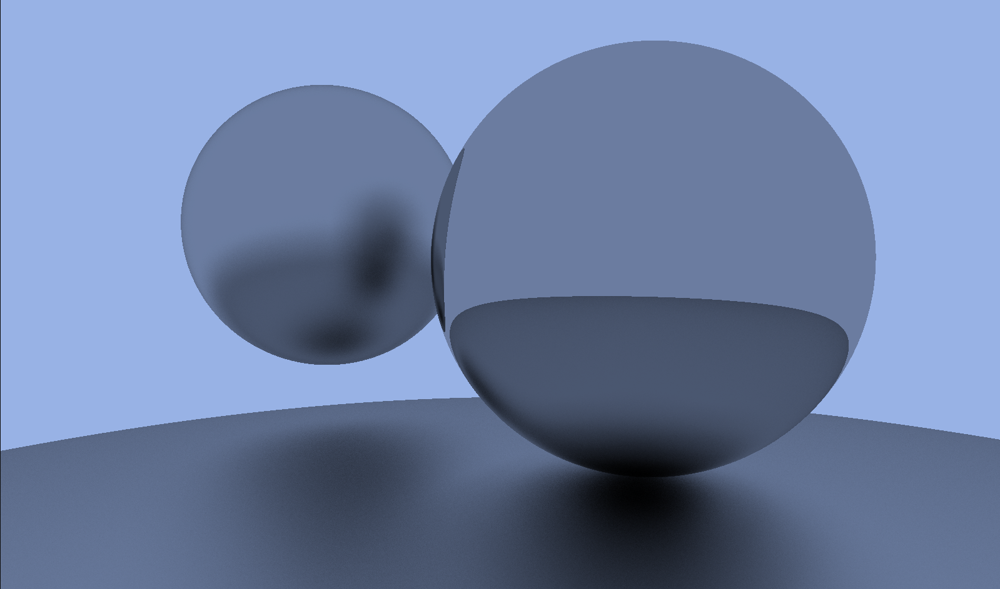
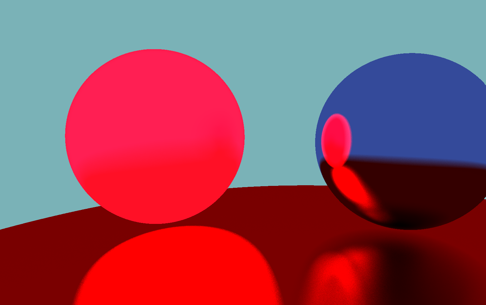
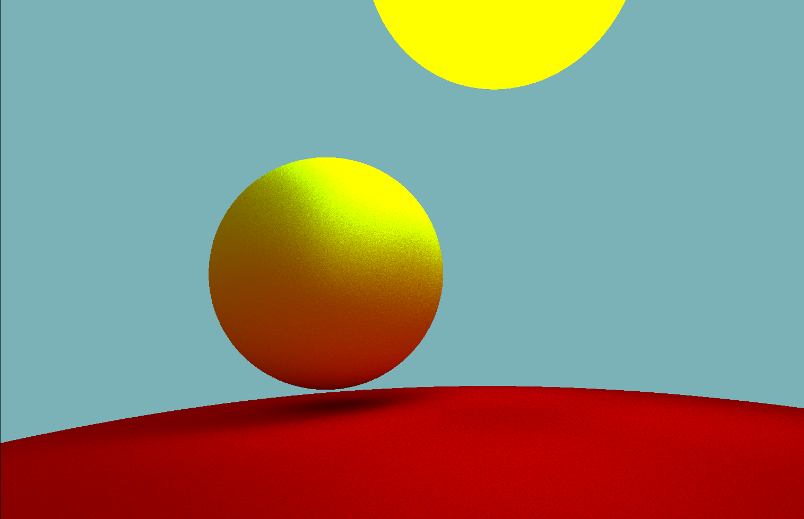
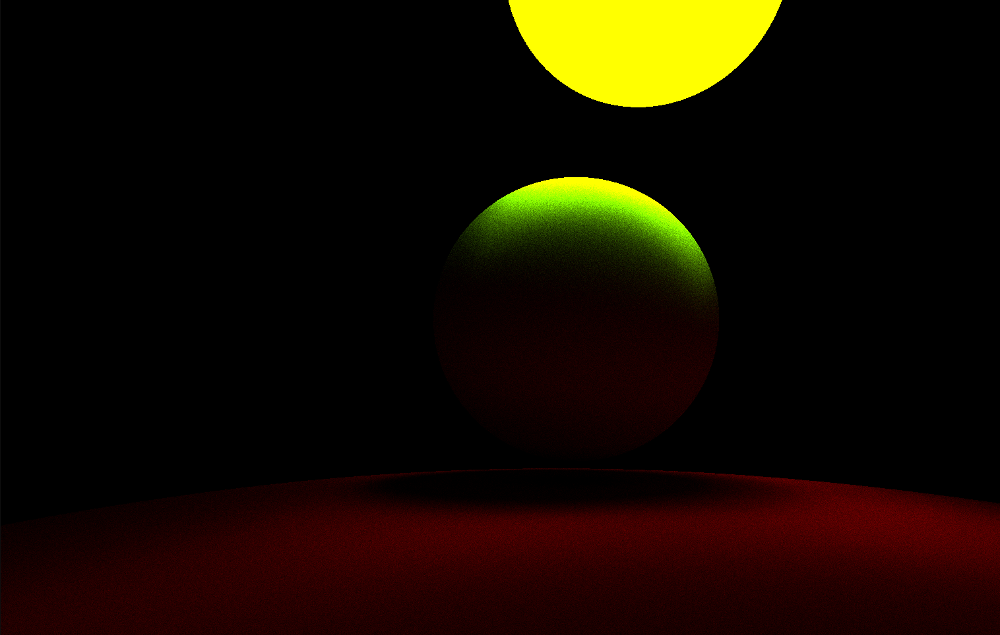
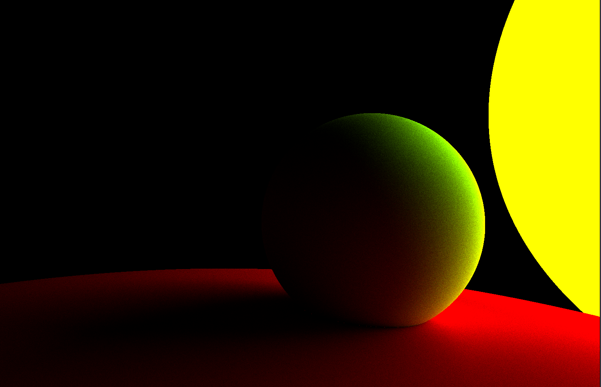

## Path Tracer
### Overview:
This is my attempt at making a path tracer. I started with following [The Cherno Ray Tracing Series](https://www.youtube.com/playlist?list=PLlrATfBNZ98edc5GshdBtREv5asFW3yXl), then I deviated and started adding my own innovations and improvements.
#### Current Goals
* Move the bulk of the ray tracing code into the GPU (Right now, we have an image which we go pixel by pixel and compute the colour there on the CPU).
* Use Vulkan Ray Tracing Acceleration Structures

#### Images:

